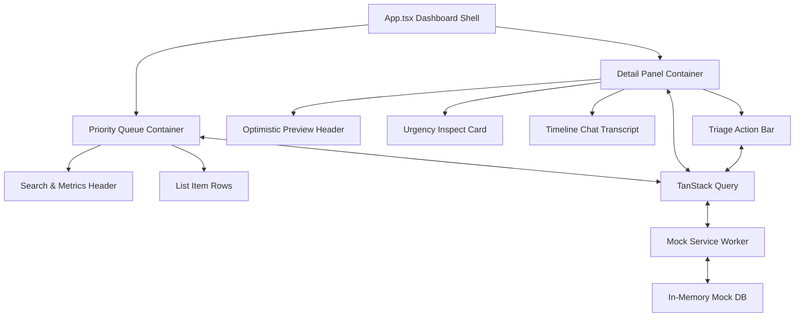

# Yellow.ai Take-Home Assignment: "The Conversation Inbox"

**Live Demo URL**: [https://the-conversation-inbox-kohl.vercel.app](https://the-conversation-inbox-kohl.vercel.app)

A triage-first workspace designed specifically for a CX agent. Instead of a generic chronological ticket feed, this workspace uses a prioritized queue driven by a computed urgency score, allowing agents to focus on high-impact customer issues.

---

## 1. Product Write-up & Scoping Decisions

### Product Scope & Intent

Generic helpdesks represent tickets as a static, chronological list, leading to slow response times for critical customers. **The Conversation Inbox** is designed as a focused triage workspace. Its primary goal is to help an agent process incoming tickets as quickly as possible.

We made three deliberate scoping decisions to support this:

- **Urgency-Ranked Triage Queue**: Conversations are sorted dynamically by a computed urgency index. The agent does not pick which ticket to answer; the system presents the most critical issues at the top of the feed.
- **Keyboard-First Interface**: An agent can navigate the entire queue, claim, resolve, snooze, and focus search fields using single-key hotkeys, keeping their hands on the keyboard.
- **Four core triage actions only**: We limited operations to **Claim**, **Resolve**, **Snooze**, and **Reassign**. This keeps the agent's workspace clean and focused on triage.

### Scoped-Out Features (v2 Roadmap)

To preserve the inbox's focus as a triage-first console, several features were intentionally postponed. These are framed as v2 roadmap enhancements rather than omissions:

- **Saved Views & Advanced Filter Builder**: Replaced by a single search field in v1. A full filter builder would add visual noise to the header. V2 will introduce quick presets (e.g. "My Assigned VIPs").
- **Analytics Dashboards**: Triage workspace performance is critical. While v1 displays three quick metrics (Unhandled, At Risk, Avg Wait), a full analytics suite has been postponed to a separate manager-facing dashboard.
- **Canned Responses & Macros**: Agent text input remains manual in v1. V2 will introduce LLM-suggested reply cards based on the computed conversation category.
- **Multi-Agent Presence**: To prevent collisions (two agents opening the same ticket), v2 will introduce live agent presence indicators powered by web socket channels.
- **Desktop Push Notifications**: Postponed in favor of keeping the agent focused on the active queue workspace.

---

## 2. Technical Architecture

The application is built using a modern, reactive stack designed for fast rendering and state synchronization:



### Domain Model

The inbox domain types are modeled strictly in TypeScript [src/types/inbox.ts](file:///e:/porjects/yello%20ai/src/types/inbox.ts):

- `Conversation`: Holds customer metadata, sentiment, wait latency, status, assigned agent, and message logs.
- `Message`: Represents chat text logs between the customer, agent, and system logs.
- `CustomerTier`: Enums VIP, PRIME, and STANDARD.
- `ConversationStatus`: Enums UNASSIGNED, ASSIGNED, SNOOZED, and RESOLVED.

### Urgency Scoring Engine

The sorting order is calculated by a pure, unit-tested engine [src/utils/urgency.ts](file:///e:/porjects/yello%20ai/src/utils/urgency.ts):

```text
Urgency Score = (Tier Points) + (Sentiment Points) + (CSAT Alert) + (Wait Latency) + (Escalation Points)
```

- **Tier**: VIP (+30), PRIME (+15).
- **Sentiment**: Angry (+40), Frustrated (+20), Positive (-10 reduction).
- **CSAT Alert**: CSAT < 3 (+25).
- **Wait Latency**: 1.5 points per minute of wait time (capped at 60 points max).
- **Escalation Category**: SLA Breach (+50), Billing Dispute (+20), Technical Bug (+15), Negative Sentiment (+10).

### Data Layer

- **MSW (Mock Service Worker)**: Intercepts browser requests, simulating network latencies (200-500ms) and response errors. Inside [src/mocks/db.ts](file:///e:/porjects/yello%20ai/src/mocks/db.ts), an in-memory database preserves mutation states during a browser session.
- **TanStack Query (React Query)**: Manages server state. It handles caching, invalidations, and mutation cycles (`onMutate`, `onError`, `onSettled`) to support optimistic updates and rollbacks.

### Component Structure

The UI is composed of structured layout sections in [src/App.tsx](file:///e:/porjects/yello%20ai/src/App.tsx):

- **Left Sidebar**: Renders main console navigation links.
- **Queue Column**: Houses metrics, search filters, and the conversation list.
- **Detail Panel**: Displays chat transcripts, contact metadata, point breakdowns, and triage controls.

---

## 3. Keyboard Shortcuts Cheatsheet

| Keyboard Shortcut | Action Description                                 |
| ----------------- | -------------------------------------------------- |
| `J` / `ArrowDown` | Move selection to the next ticket in the queue     |
| `K` / `ArrowUp`   | Move selection to the previous ticket in the queue |
| `C`               | Claim the selected ticket (Assign to yourself)     |
| `R`               | Resolve the selected ticket                        |
| `S`               | Snooze the selected ticket                         |
| `/`               | Focus the search input field                       |
| `Esc`             | Close details pane / Blur search input focus       |

---

## 4. Known Limitations

- **State Persistence**: The MSW database is maintained in browser memory. Reloading the browser tab resets the dataset back to its default procedurally generated list of 45 conversations.
- **Static Latency Wait**: Wait times (`waitTimeMinutes`) do not increment in real-time. They represent a snapshot at the time of page load.

---

## 5. Development Metrics (Estimated Time Spent)

Total development time: **approx. 5.5 hours**

- **Scaffolding, Linters & Tailwind Tokens**: 0.5 hours
- **Scoring Logic & Vitest Suite**: 1 hour
- **MSW Worker & TanStack Query Setup**: 1 hour
- **Layout Grid & Skeleton Structures**: 1 hour
- **Queue Rendering & Optimistic Details**: 1 hour
- **Triage Mutations & Keyboard Shortcuts Pass**: 1 hour

---

## 6. Setup and Installation

### Prerequisites

Ensure you have [Node.js](https://nodejs.org/) installed (v18 or higher recommended).

### Installation

1. Clone the repository and navigate to the project directory:
   ```bash
   cd "The-Conversation-Inbox"
   ```
2. Install dependencies:
   ```bash
   npm install
   ```

### Development Scripts

- **Start Dev Server**: Run `npm run dev` to start the local Vite development server.
- **Production Build**: Run `npm run build` to verify compiling, formatting, and assets bundling.
- **Lint Code**: Run `npm run lint` to check for code issues using ESLint.
- **Format Code**: Run `npm run format` to auto-format files using Prettier.
- **Run Unit Tests**: Run `npm run test` to execute Vitest unit tests.
